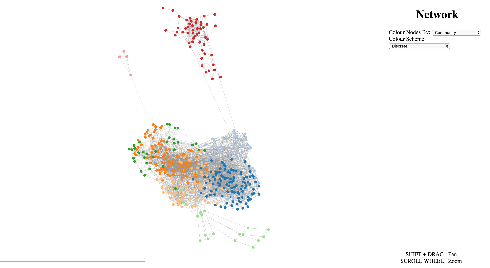

Introduction
====================================

:code:`netshape` is a command-line that is designed to help scaffold browser-based
network visualizations, so that they can be shared with others in an interactive manner while still remaining lightweight. Often it is useful to zoom and pan around a network in order to get a sense of
particular details that any static image could not capture. :code:`netshape` is
the solution to that problem.

Installation
~~~~~~~~~~~~~~~~~
See: :doc:`Overview </index>` for installation instructions.

Default Usage
~~~~~~~~~~~~~~~~~
By default, :code:`netshape` offers two subcommands, though it can be easily extended
to include more.

:code:`netshape build`
    accepts as arguments the name of a csv-formatted edgelist file (JSON network option coming soon), or a csv-formatted edgelist from :code:`stdin`, as well as some optional parameters.
    The eigenvector centrality, degree, and a modularity maximizing community assignment is then computed for all nodes.
    A json representation of this network is then used alongside the d3.js library to build a
    visualization of the network in the browser, by default in a subfolder named 'dist' which can be coloured according
    to the statistics that were computed earlier.

    **Arguments**

        .. option:: network

            The csv formatted edgelist representing the network to be visualized. Also accepts from :code:`stdin`

        .. option:: -h, --help

            Displays a help message.

        .. option:: -s SEP, --seps SEP

           the string delimiter between values in the edgelist (default: ",")

        .. option:: -d DIRECTED, --directed DIRECTED

           Boolean indicator - true if the graph is directed (default: True)

        .. option:: -o OUT, --out OUT

            The name of the file to build the web visualization in (default: "dist")

        .. option:: -n NAME, --name NAME

            The name of the visualization in that appears in the browser UI (default: "Network")

:code:`netshape serve`
    a utility function that serves the web visualization on a localhost server (port 8000 by default)

    **Arguments**

        .. option:: -p PORT, --port PORT

             The port to serve on.

Web Interface
~~~~~~~~~~~~~~~~~
Below is a sample view of the default web interface for the visualization.
The particular network is a *C. Elegans* neural connectome.

There are options on the right side to colour the network according to
the various network statistics that were computed before it was built, as well as choose between discrete and continuous colour schemes. It is also possible to
zoom and pan the view of the network. When the mouse hovers over a node, that node's ID
will appear above the node. Nodes are arranged according to a force-directed layout, but can be dragged
interactively by clicking and dragging with the mouse.

